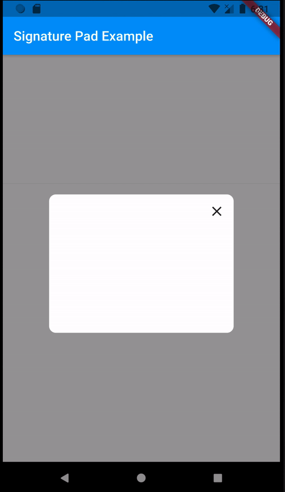

# Signature Pad

The signature pad is the flutter plugin that allows users to draw on the canvas and get the signature as Base64 image. 

## Preview


## Features
* set canvas boundaries.
* set drawing pen color, pen size, canvas border radius.
* set callback function to the signature


## Example 
```
import 'package:signature_pad/signature_pad.dart';

// initialise the variable to store signature image
Uint8List signatureBytes;

// USe the SignaturePad Widget
            SignaturePad(
                onChnaged: (base64Image) {
                  displaySIgnatureImage(image);
                },
                height: size.width ~/ 2,
                width: size.width ~/ 1.5,
              ),


// process the base64 image 
  void displaySIgnatureImage(String bytes) async {
    if (bytes == null) return;
    Uint8List convertedBytes = base64Decode(bytes);
    setState(() {
      signatureBytes = convertedBytes;
    });
  }
```

## Contribution and support
- If you want to contribute to the code, please create a pull request. 
- If you find any bug, please create an issue.
